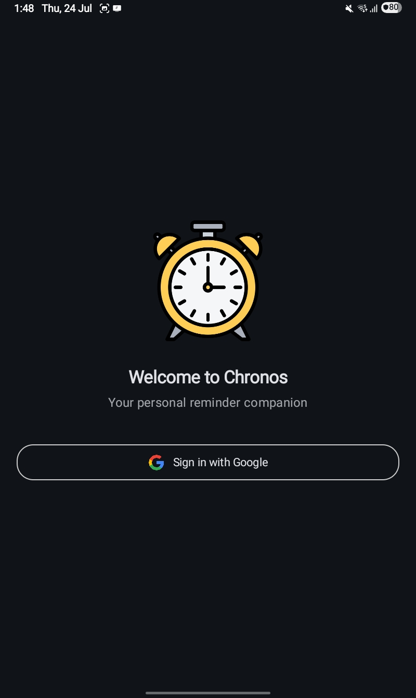
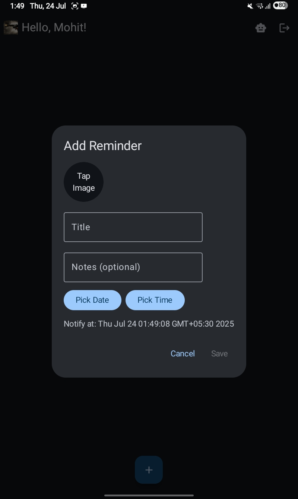
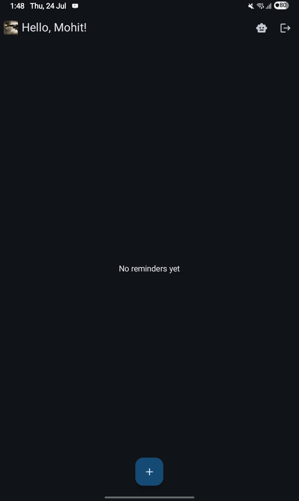

# Chronos

**Chronos** is your friendly Android reminder app—a digital companion that helps you remember important moments, tasks, or birthdays, and even generates on-demand AI greetings you can share with friends.

## 🚀 Key Features

- **Google Sign-In**  
  Secure, one-tap authentication powered by Firebase Auth.

- **Add & Manage Reminders**  
  - Title, notes, date & time  
  - Optional photo (camera or gallery)  
  - List view with newest-first ordering  
  - Edit or delete any reminder via a simple dialog

- **Image Thumbnails**  
  Reminders with photos show a small inline preview for quick recognition.

- **Local Notifications**  
  - Schedules alarms with AlarmManager  
  - Requests runtime permission on Android 13+  
  - Fires high-priority alerts at your chosen time

- **Dynamic Theming**  
  Follows system dark/light mode out of the box.

- **AI-Powered Greetings**  
  - Tap “🤖” in the top bar to open an AI dialog  
  - Enter a prompt (e.g., “Write a birthday wish for Prashant”)  
  - Generate text via Pollinations.ai and share instantly with friends

## 🛠 Tech Stack

- **UI**: Jetpack Compose (Material 3)  
- **Architecture**: MVVM + Clean Architecture  
- **Async**: Kotlin Coroutines & Flow  
- **DI**: ViewModelFactory (swap in Hilt or Dagger if preferred)  
- **Backend**: Firebase Auth, Firestore, Storage  
- **Notifications**: AlarmManager + NotificationChannel  
- **Networking**: OkHttp for AI calls

## 📸 Screenshots

Below are screenshots of the Chronos app showcasing key features:

### Sign In Screen


### Add Reminder Dialog


### Home Screen


##  Getting Started

1. **Clone the repo**  
   ```bash
   git clone https://github.com/Ghanshyam32/chronos-app.git
   ```

2. **Set up Firebase**  
   - Create an Android app in your Firebase console.  
   - Download `google-services.json` and place it in `app/`.  
   - Enable Firestore, Storage, and Google Sign-In in the console.  
   - In Firestore rules, allow read/write for authenticated users.

3. **Build & Run**  
   - Open in Android Studio (Arctic Fox or later).  
   - Sync Gradle, then Run on an emulator or device.  
     - On first launch, grant notification permission when prompted.

4. **Configure AI API**  
   - No keys required—Pollinations.ai is fully public.  
   - Ensure `<uses-permission android:name="android.permission.INTERNET" />` is in `AndroidManifest.xml`.

##  Usage

- **Sign In**: Tap the Google button on launch.  
- **Add Reminder**: Tap the ➕ FAB, fill in details, pick a date/time, add an optional photo, then Save.  
- **Edit/Delete**: Tap a reminder row to open the edit/delete dialog.  
- **AI Greeting**: Tap the 🤖 icon, type your prompt, hit “Generate,” then “Share.”  
- **Notifications**: Allow notifications when prompted; if declined, enable them in Android Settings → Apps → Chronos → Notifications.